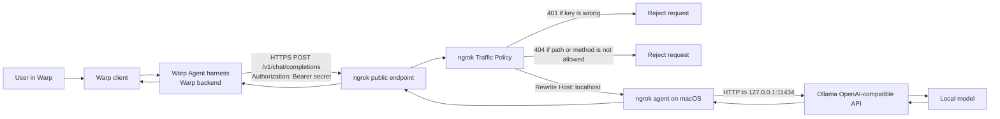

# Running a Local Ollama Model in Warp Through ngrok on macOS

> [!NOTE]
> In this document, **Warp** means the Warp terminal application, not Cloudflare WARP.
>
> Last verified: **16 August 2026**. The setup described here was tested with Ollama on `localhost:11434`, ngrok agent `3.39.11`, Warp's **Custom inference endpoint**, and the Ollama model `gemma4:26b`.

## What this setup does

This configuration lets Warp use an LLM that runs locally in Ollama while still satisfying Warp's requirement that a custom inference endpoint be reachable from the public internet.

The completed flow is:

1. Warp sends the prompt, terminal context, tool definitions, endpoint URL, and endpoint credential to Warp's server-side agent harness.
2. Warp's backend calls a public HTTPS endpoint hosted by ngrok.
3. An ngrok Traffic Policy validates a private bearer token and blocks unwanted API paths.
4. ngrok rewrites the upstream `Host` header to `localhost` and forwards the request through the ngrok agent to Ollama on the Mac.
5. Ollama runs the selected model locally and streams the result back through ngrok and Warp.

Warp requires an endpoint that implements `POST /v1/chat/completions` and is publicly reachable. Ollama provides an OpenAI-compatible API on `http://localhost:11434/v1`, while ngrok provides the public HTTPS bridge.[^warp-custom] [^ollama-openai]

> [!IMPORTANT]
> The **model inference is local**, but the complete interaction is **not fully local or peer-to-peer**. Warp's agent harness runs on Warp's backend, so prompts, context, tool definitions, responses, endpoint URL, and the endpoint key transit Warp's infrastructure. Warp states that the endpoint key is stored locally and only used in flight, but the request path still includes Warp's servers.[^warp-custom]

## Architecture



### Trust boundaries

| Boundary | What crosses it | Protection |
|---|---|---|
| Warp client → Warp backend | Prompt, terminal context, tool definitions, endpoint URL, endpoint key | TLS; Warp's documented handling of custom endpoint credentials |
| Warp backend → ngrok public endpoint | OpenAI-compatible HTTPS request and bearer token | TLS plus a long random bearer token |
| ngrok cloud → ngrok agent | Request and response traffic | ngrok's encrypted agent connection |
| ngrok agent → Ollama | Local HTTP request | Loopback/local-machine connection |
| Ollama → model | Prompt and generation workload | Local process and local hardware |

## Tooling

| Component | Role |
|---|---|
| **Warp terminal** | Agent UI and terminal integration; configured with a custom OpenAI-compatible inference endpoint |
| **Ollama** | Runs the LLM locally and exposes the OpenAI-compatible `/v1` API |
| **ngrok agent** | Maintains the outbound tunnel from the Mac to ngrok |
| **ngrok development domain** | Stable public HTTPS URL used by Warp |
| **ngrok Traffic Policy** | Validates the bearer token, limits exposed paths, and rewrites `Host` for Ollama |
| **macOS `launchd`** | Starts and restarts ngrok as a background service |
| **`curl`** | Verifies each layer independently |
| **`openssl`** | Generates the private bearer token |
| **`pbcopy`** | Copies the bearer token into Warp without printing it unnecessarily |

## Values used in the tested setup

The examples below are deliberately sanitized. Do not publish your actual ngrok authtoken or bearer token.

| Setting | Tested value or pattern |
|---|---|
| Local Ollama URL | `http://localhost:11434` |
| OpenAI-compatible base URL | `http://localhost:11434/v1` |
| Public ngrok URL | `https://<your-assigned-ngrok-domain>` |
| Warp endpoint URL | `https://<your-assigned-ngrok-domain>/v1` |
| Model ID | `gemma4:26b` |
| Local key file | `~/.config/warp-ollama/api-key` |
| Traffic Policy file | `~/.config/warp-ollama/ngrok-policy.yml` |
| ngrok endpoint name | `ollama-warp` |

The model identifier entered in Warp must match the output of `ollama list` exactly, including any namespace, tag, capitalization, and `:latest` suffix.

---

## 1. Verify Ollama locally

Make sure Ollama is running:

```bash
ollama list
```

Example output:

```text
NAME          ID              SIZE
...
gemma4:26b   ...             ...
```

Check the local OpenAI-compatible model-list endpoint:

```bash
curl -i http://localhost:11434/v1/models
```

Expected result:

```text
HTTP/1.1 200 OK
Content-Type: application/json
```

The JSON body should contain the exact model ID you plan to use.

Test a local completion before introducing ngrok or Warp:

```bash
curl -i --max-time 180 \
  'http://localhost:11434/v1/chat/completions' \
  -H 'Authorization: Bearer ollama' \
  -H 'Content-Type: application/json' \
  -d '{
    "model": "gemma4:26b",
    "messages": [
      {
        "role": "user",
        "content": "Reply with exactly OK"
      }
    ],
    "stream": false
  }'
```

Ollama's OpenAI compatibility layer accepts an API-key field because many OpenAI clients require one, but Ollama itself ignores the value.[^ollama-openai] That is acceptable on `localhost`; it is **not** sufficient protection once the service is exposed publicly. We add real enforcement at ngrok.

## 2. Install and authenticate ngrok

Install the current ngrok agent using ngrok's official instructions or a package manager, then associate it with your ngrok account:

```bash
ngrok config add-authtoken '<YOUR_NGROK_AUTHTOKEN>'
```

The ngrok **authtoken** identifies the local agent to ngrok. It is not the key Warp will use and must not be pasted into Warp.

Check the installed version and configuration file:

```bash
ngrok version
ngrok config check
```

On the free plan, use the development domain assigned to your account. The domain is stable and can be reused by the endpoint, although the ngrok agent on your Mac still has to be online for requests to reach Ollama.[^ngrok-domains]

For the rest of this guide, export the assigned URL without `/v1`:

```bash
export NGROK_BASE='https://<your-assigned-ngrok-domain>'
```

For example, the value may resemble:

```text
https://example.ngrok-free.dev
```

Do not assume the suffix; use the exact domain shown in your ngrok dashboard.

## 3. Create a real bearer token and Traffic Policy

The following script creates:

- a 256-bit random bearer token;
- a key file readable only by the current user;
- an ngrok Traffic Policy that checks the token;
- a method-and-path allow-list;
- the `Host: localhost` rewrite required for Ollama behind ngrok.

Run:

```bash
mkdir -p "$HOME/.config/warp-ollama"
chmod 700 "$HOME/.config/warp-ollama"

KEY="$(openssl rand -hex 32)"

printf '%s\n' "$KEY" \
  > "$HOME/.config/warp-ollama/api-key"

chmod 600 "$HOME/.config/warp-ollama/api-key"

cat > "$HOME/.config/warp-ollama/ngrok-policy.yml" <<EOF
on_http_request:
  # Rule 1: require the exact bearer token generated above.
  - name: Require Warp bearer token
    expressions:
      - 'size(getReqHeader("Authorization").filter(v, v == "Bearer ${KEY}")) == 0'
    actions:
      - type: custom-response
        config:
          status_code: 401
          headers:
            content-type: application/json
          body: '{"error":{"message":"Unauthorized"}}'

  # Rule 2: expose only the two OpenAI-compatible operations used here.
  - name: Allow only models and chat completions
    expressions:
      - '!((req.method == "GET" && req.url.path == "/v1/models") || (req.method == "POST" && req.url.path == "/v1/chat/completions"))'
    actions:
      - type: custom-response
        config:
          status_code: 404
          headers:
            content-type: application/json
          body: '{"error":{"message":"Not found"}}'

  # Rule 3: Ollama expects the upstream Host header to be local.
  - name: Rewrite host for Ollama
    actions:
      - type: add-headers
        config:
          headers:
            host: localhost
EOF

chmod 600 "$HOME/.config/warp-ollama/ngrok-policy.yml"
unset KEY

# Copy the endpoint key to the clipboard without a trailing newline.
tr -d '\r\n' < "$HOME/.config/warp-ollama/api-key" | pbcopy

echo 'Warp endpoint key generated and copied to the clipboard.'
```

ngrok's official Ollama example uses a Traffic Policy to rewrite the upstream `Host` header to `localhost` so Ollama accepts the request.[^ngrok-ollama] The authentication and path restrictions are additional controls in this setup. ngrok Traffic Policy supports request-header inspection, CEL expressions, custom responses, and header rewriting.[^ngrok-policy]

> [!WARNING]
> The policy file now contains the bearer token in plaintext. File mode `600` prevents other normal users on the Mac from reading it, but the file must never be committed to Git or included in screenshots, backups shared with others, or support bundles.

## 4. Test ngrok interactively

Before configuring background startup, prove that the endpoint works from an interactive ngrok process:

```bash
ngrok http 11434 \
  --url "$NGROK_BASE" \
  --traffic-policy-file "$HOME/.config/warp-ollama/ngrok-policy.yml"
```

A successful session should show a forwarding line similar to:

```text
Forwarding  https://<your-assigned-ngrok-domain> -> http://localhost:11434
```

### Why the Host rewrite matters

Without the Traffic Policy, the first public completion request may appear in the ngrok console as:

```text
POST /v1/chat/completions  403 Forbidden
```

The fix is not an Ollama API key. The fix is the `Host: localhost` rewrite in the ngrok Traffic Policy.[^ngrok-ollama]

## 5. Verify authentication and inference through ngrok

Leave ngrok running and open a second terminal.

Set the variables:

```bash
export NGROK_BASE='https://<your-assigned-ngrok-domain>'
export MODEL='gemma4:26b'
export WARP_OLLAMA_KEY="$(tr -d '\r\n' < "$HOME/.config/warp-ollama/api-key")"
```

### 5.1 Confirm that anonymous access is denied

```bash
curl -i "$NGROK_BASE/v1/models"
```

Expected result:

```text
HTTP/2 401
content-type: application/json

{"error":{"message":"Unauthorized"}}
```

This `401` is a success condition: the public URL exists, but the policy blocks callers without the bearer token.

A `%` character may appear immediately after the JSON in zsh because the response has no final line break. It is not part of the response.

### 5.2 Confirm that the correct key is accepted

```bash
curl -i \
  "$NGROK_BASE/v1/models" \
  -H "Authorization: Bearer $WARP_OLLAMA_KEY"
```

Expected result:

```text
HTTP/2 200
```

The JSON response should contain `gemma4:26b`.

### 5.3 Test a complete non-streaming inference

```bash
curl -i --max-time 180 \
  "$NGROK_BASE/v1/chat/completions" \
  -H "Authorization: Bearer $WARP_OLLAMA_KEY" \
  -H 'Content-Type: application/json' \
  -d "{
    \"model\": \"$MODEL\",
    \"messages\": [
      {
        \"role\": \"user\",
        \"content\": \"Reply with exactly OK\"
      }
    ],
    \"stream\": false
  }"
```

Expected result:

```text
HTTP/2 200
```

The body should contain an OpenAI-compatible `choices` array and the model's answer.

### 5.4 Test streaming

Warp normally consumes a streaming response, so test that path as well:

```bash
curl -N --max-time 180 \
  "$NGROK_BASE/v1/chat/completions" \
  -H "Authorization: Bearer $WARP_OLLAMA_KEY" \
  -H 'Content-Type: application/json' \
  -d "{
    \"model\": \"$MODEL\",
    \"messages\": [
      {
        \"role\": \"user\",
        \"content\": \"Count from one to five.\"
      }
    ],
    \"stream\": true
  }"
```

You should see incremental response chunks rather than one final JSON document.

### 5.5 Confirm that Ollama's administrative API is not exposed

The policy allows only `/v1/models` and `/v1/chat/completions`. This request should therefore return `404` even with the correct key:

```bash
curl -i \
  "$NGROK_BASE/api/tags" \
  -H "Authorization: Bearer $WARP_OLLAMA_KEY"
```

Expected result:

```text
HTTP/2 404
```

Clear the shell variables when finished:

```bash
unset WARP_OLLAMA_KEY MODEL
```

## 6. Configure a persistent ngrok endpoint

The interactive command proves the design. The next step moves the endpoint into ngrok's version 3 configuration so it can be started by name and by the operating-system service.

Upgrade the config format if needed:

```bash
ngrok config upgrade 3
```

Find and edit the actual config file:

```bash
ngrok config check
ngrok config edit
```

Preserve the existing authtoken and add an endpoint resembling this:

```yaml
version: 3

agent:
  authtoken: YOUR_EXISTING_NGROK_AUTHTOKEN
  console_ui: false

endpoints:
  - name: ollama-warp
    url: https://<your-assigned-ngrok-domain>
    traffic_policy_file: /Users/<your-macos-user>/.config/warp-ollama/ngrok-policy.yml
    upstream:
      url: 11434
      protocol: http1
```

Important details:

- Keep only one top-level `version`, `agent`, and `endpoints` section.
- Preserve any existing endpoints by adding `ollama-warp` to the current list.
- Use the full absolute path in `traffic_policy_file`; do not use `~` or `$HOME` inside the YAML.
- Use the public URL **without** `/v1`. The `/v1` suffix belongs in Warp's endpoint setting.
- Do not replace the ngrok authtoken with the Warp bearer token. They serve different purposes.

ngrok version 3 uses the top-level `agent` and `endpoints` fields, and supports `traffic_policy_file` on an endpoint definition.[^ngrok-config]

Validate the configuration:

```bash
ngrok config check
```

Start the named endpoint interactively:

```bash
ngrok start ollama-warp
```

Repeat the `401` and `200` curl tests before moving on.

## 7. Run ngrok automatically as a macOS service

Stop the interactive ngrok process with `Ctrl+C`.

Find the exact config path with:

```bash
ngrok config check
```

Then install the ngrok service, replacing the example path with the path printed by the command:

```bash
NGROK_BIN="$(command -v ngrok)"
NGROK_CONFIG="$HOME/Library/Application Support/ngrok/ngrok.yml"

sudo "$NGROK_BIN" service install --config "$NGROK_CONFIG"
sudo "$NGROK_BIN" service start
```

If the service was already installed:

```bash
sudo "$(command -v ngrok)" service restart
```

The ngrok service starts all endpoints in the selected config, starts at boot, restarts after crashes, and uses macOS `launchd`.[^ngrok-service]

### Verify that it is truly running in the background

1. Make sure no interactive `ngrok` process remains open.
2. Wait a few seconds.
3. Run the authenticated `/v1/models` curl test again.
4. Restart the Mac and repeat the test.

A working background setup returns `200` without opening a terminal and starting ngrok manually.

### Make sure Ollama also starts

The tunnel can be online while Ollama is offline. Ensure the Ollama application is enabled in **System Settings → General → Login Items**, or use the startup mechanism appropriate to your Ollama installation.

The complete boot sequence should be:

```text
macOS starts
  → Ollama starts and listens on localhost:11434
  → launchd starts the ngrok service
  → ngrok activates the fixed public endpoint
  → Warp can call the saved endpoint with the saved key
```

## 8. Configure Warp

In Warp, open **Settings**, search for **inference endpoint**, and add a custom endpoint with these values:

| Warp field | Value |
|---|---|
| **API schema** | `OpenAI Chat Completions` |
| **Endpoint name** | `Ollama Local` or another descriptive name |
| **Endpoint URL** | `https://<your-assigned-ngrok-domain>/v1` |
| **API key** | Contents of `~/.config/warp-ollama/api-key` |
| **Model name** | Exact output from `ollama list`, for example `gemma4:26b` |
| **Model alias** | Optional, for example `Gemma Local` |

Copy the key into the clipboard without printing it:

```bash
tr -d '\r\n' < "$HOME/.config/warp-ollama/api-key" | pbcopy
```

The endpoint URL is the base URL ending in `/v1`; do **not** enter the full `/v1/chat/completions` path. Warp appends the Chat Completions route.[^warp-custom]

After saving, explicitly choose the custom model in Warp's model picker. Warp's **Auto** option does not automatically route to a configured custom endpoint.[^warp-custom]

## 9. End-to-end test in Warp

Select the custom model and send a low-risk prompt, for example:

```text
Which shell am I running? Use the available terminal context, but do not execute anything.
```

Then try a terminal-agent task that requires tool use. A model may respond successfully to plain chat but still perform poorly with terminal tools. Model quality, tool/function-calling ability, context length, and available RAM all affect the Warp Agent experience.

Watch the ngrok request log during the first test. A healthy request should resemble:

```text
POST /v1/chat/completions  200 OK
```

---

## How authentication works

There are three credentials people often confuse:

| Credential | Stored where | Used by | Should be entered in Warp? |
|---|---|---|---|
| **ngrok authtoken** | ngrok config | Local ngrok agent authenticating to ngrok | **No** |
| **ngrok management API key** | Optional ngrok config/dashboard | `ngrok api` management commands | **No** |
| **Warp/Ollama endpoint bearer token** | Local key file, ngrok policy, Warp secure storage | ngrok Traffic Policy authenticating inference requests | **Yes** |

Ollama does not validate the bearer token. ngrok does. The request is rejected at the public edge before it reaches Ollama when the key is absent or wrong.

The public ngrok URL is not a password and should be treated as discoverable. The bearer token is the primary authorization control in this design.

## Security considerations

### What this setup protects

- Anonymous users cannot call the endpoint without the bearer token.
- Only `GET /v1/models` and `POST /v1/chat/completions` are exposed.
- Ollama's native `/api/*` administration endpoints are blocked by the policy.
- The public endpoint uses HTTPS.
- Ollama can remain bound to localhost rather than the LAN.
- The bearer token is generated with 256 bits of randomness and stored with restrictive local permissions.

### What this setup does not protect against

- Malware or an administrator account on the Mac can read the local policy and key files.
- Warp receives the endpoint key in flight and routes prompts through its backend as part of the custom inference architecture.[^warp-custom]
- Anyone who obtains the bearer token can use the endpoint until the token is rotated.
- A sufficiently expensive request can consume CPU, GPU, memory, electricity, and ngrok quota.
- The Mac must be awake, connected, running Ollama, and running ngrok.
- Local model inference does not make Warp's surrounding agent workflow fully local.

### ngrok request inspection

The local ngrok inspection UI can display request headers, request bodies, and response bodies, which may include prompts, terminal context, bearer tokens, and model output. ngrok's cloud Traffic Inspector stores metadata by default; full body capture is an opt-in account setting.[^ngrok-inspector]

After debugging, consider disabling both the local inspection database and its web UI by adding these settings under `agent:` in the ngrok config:

```yaml
agent:
  authtoken: YOUR_EXISTING_NGROK_AUTHTOKEN
  console_ui: false
  inspect_db_size: -1
  web_addr: false
```

`inspect_db_size: -1` disables the agent's local inspection database; `web_addr: false` disables the local inspection UI and API.

Then restart the service:

```bash
sudo "$(command -v ngrok)" service restart
```

Also verify in the ngrok dashboard that **Full Capture** is disabled unless you explicitly need it.

### Repository hygiene

Add these patterns to the `.gitignore` of any repository used to hold local setup material:

```gitignore
# Local Warp/Ollama/ngrok credentials and generated policy
api-key
ngrok-policy.yml
ngrok.yml
.env
```

Do not copy the generated policy file into the GitHub repository. Publish a template with placeholders instead.

## Routine operations

### Health check

```bash
KEY="$(tr -d '\r\n' < "$HOME/.config/warp-ollama/api-key")"

curl -fsS \
  'https://<your-assigned-ngrok-domain>/v1/models' \
  -H "Authorization: Bearer $KEY" \
  >/dev/null \
  && echo 'Warp/Ollama endpoint is healthy' \
  || echo 'Endpoint check failed'

unset KEY
```

### Restart the tunnel

```bash
sudo "$(command -v ngrok)" service restart
```

### Stop the tunnel

```bash
sudo "$(command -v ngrok)" service stop
```

### Start it again

```bash
sudo "$(command -v ngrok)" service start
```

### View recent macOS logs

```bash
log show \
  --last 15m \
  --style compact \
  --predicate 'process == "ngrok"'
```

For a live stream:

```bash
log stream \
  --style compact \
  --predicate 'process == "ngrok"'
```

### Add another Ollama model to Warp

1. Pull or create the model in Ollama.
2. Confirm its exact ID with `ollama list`.
3. Add another model row under the same Warp endpoint.
4. Keep the same endpoint URL and bearer token.

No ngrok change is required because the model name is carried in the JSON request body.

## Rotate the bearer token

Rotate immediately if the token or policy file may have been exposed.

This command creates a new key and updates the policy while preserving the path and Host rules:

```bash
KEY="$(openssl rand -hex 32)"

printf '%s\n' "$KEY" \
  > "$HOME/.config/warp-ollama/api-key"

chmod 600 "$HOME/.config/warp-ollama/api-key"

python3 - "$KEY" "$HOME/.config/warp-ollama/ngrok-policy.yml" <<'PY'
from pathlib import Path
import re
import sys

key = sys.argv[1]
path = Path(sys.argv[2])
text = path.read_text()

pattern = r'Bearer [0-9a-f]{64}'
updated, count = re.subn(pattern, f'Bearer {key}', text, count=1)

if count != 1:
    raise SystemExit(
        'Could not find exactly one 64-character bearer token in the policy. '
        'Review the policy manually before restarting ngrok.'
    )

path.write_text(updated)
PY

chmod 600 "$HOME/.config/warp-ollama/ngrok-policy.yml"
unset KEY

sudo "$(command -v ngrok)" service restart
tr -d '\r\n' < "$HOME/.config/warp-ollama/api-key" | pbcopy

echo 'New key copied. Replace the API key in Warp now.'
```

There is a brief cutover dependency: after ngrok restarts, the old Warp key stops working. Paste the newly copied key into Warp and save the endpoint configuration.

## Troubleshooting

| Symptom | Likely cause | Resolution |
|---|---|---|
| `curl: (3) URL rejected: No host part in the URL` | A shell variable such as `$BASE` or `$NGROK_BASE` is empty | Export the variable first or use the literal URL |
| Local `/v1/models` returns `200`, but public completion returns `403` | The public `Host` header reaches Ollama unchanged | Apply the ngrok Traffic Policy that rewrites `Host` to `localhost` |
| Public request without a key returns `401` | Authentication is working | This is the expected result |
| Public request with the key still returns `401` | Wrong key, stale Warp setting, newline, or policy/key mismatch | Copy with `tr -d '\r\n'`; compare the key file with the value embedded in the local policy; restart ngrok after policy changes |
| `/api/tags` returns `404` with the correct key | The allow-list is working | This is expected |
| `/v1/chat/completions` returns `404` | Wrong public base URL, missing `/v1`, wrong method, or path policy mismatch | Warp URL should end in `/v1`; curl should POST to `/v1/chat/completions` |
| ngrok returns `502`, or the request cannot reach the upstream | Ollama is stopped or not listening on `11434` | Run `curl http://localhost:11434/v1/models`; start Ollama |
| Ollama says the model is not found | Warp's model ID does not exactly match Ollama | Copy the complete ID from `ollama list` |
| Warp says the API key is invalid, while ngrok shows `401` or `403` | Warp is surfacing the upstream authorization failure | Test the same endpoint and key with curl; fix the ngrok policy or key rather than changing Ollama |
| curl works but Warp does not | Wrong Warp endpoint base URL, stale key, custom model not selected, or model/tool incompatibility | Use the `/v1` base URL, replace the key, explicitly select the custom model, and test a basic prompt |
| Warp still uses hosted models or credits | **Auto** remains selected | Select the custom endpoint-routed model explicitly |
| Tunnel works only while an ngrok terminal window is open | The background service is not installed or is using the wrong config | Install the service with the exact path from `ngrok config check` |
| Service starts but endpoint fails after reboot | Ollama did not start, config path is unreadable, or the dev domain is wrong | Verify Ollama login startup, absolute file paths, service logs, and the URL in the config |
| Responses are very slow or time out | First model load, insufficient memory, large context, or a slow model | Test locally, allow a longer curl timeout, and try a smaller model |
| Streaming curl works locally but not over the public URL | Tunnel or proxy is buffering streaming responses | Verify with `curl -N`; use a tunnel that supports streaming |

## Why ngrok was used instead of a Cloudflare Quick Tunnel

A Cloudflare Quick Tunnel was tested first with a random `trycloudflare.com` URL. It was useful for proving public connectivity, but Cloudflare documents that Quick Tunnels do not support Server-Sent Events. Streaming model responses commonly use this pattern, so the Quick Tunnel is not a good fit for a persistent Warp inference endpoint.[^cloudflare-quick]

A named Cloudflare Tunnel could be made to work, but ngrok was quicker for this setup because:

- Warp's own Ollama guide explicitly shows ngrok as the public bridge.[^warp-ollama]
- ngrok provides a reusable development domain on the free account.
- the official ngrok Ollama guide documents the required `Host` rewrite.[^ngrok-ollama]
- Traffic Policy can enforce the bearer token without adding Nginx, Caddy, or a custom proxy.
- the ngrok agent can install itself as a native macOS service.

## Free-plan considerations

At the time this guide was verified, ngrok's free plan included one development domain, up to three online endpoints, 20,000 HTTP requests per month, 1 GB of outbound data per month, and up to five Traffic Policy rules per policy. Free development endpoints have no fixed session timeout and can remain online while the agent is running.[^ngrok-free]

The setup in this guide uses three Traffic Policy rules:

1. bearer-token validation;
2. method-and-path allow-list;
3. `Host` rewrite.

Long LLM responses may consume the data quota before the request-count quota. Check the current ngrok limits before relying on this for heavy or shared usage.

## Files created

```text
~/.config/warp-ollama/
├── api-key                 # secret; mode 600; never commit
└── ngrok-policy.yml        # contains the same secret; mode 600; never commit

~/Library/Application Support/ngrok/
└── ngrok.yml               # typical macOS location; confirm with ngrok config check
```

The ngrok config path varies by installation and platform. Always use `ngrok config check` as the source of truth.[^ngrok-config]

## Remove the setup

Stop and uninstall the ngrok service:

```bash
NGROK_BIN="$(command -v ngrok)"

sudo "$NGROK_BIN" service stop
sudo "$NGROK_BIN" service uninstall
```

Remove the local credentials and policy:

```bash
rm -rf "$HOME/.config/warp-ollama"
```

Then remove the custom inference endpoint from Warp. Preserve the ngrok config if it contains other endpoints; otherwise remove only the `ollama-warp` entry rather than deleting unrelated settings.

## References

[^warp-custom]: [Warp documentation: Custom inference endpoint](https://docs.warp.dev/agents/inference/custom-inference-endpoint/)
[^warp-ollama]: [Warp documentation: Set up Ollama](https://docs.warp.dev/guides/external-tools/how-to-set-up-ollama/)
[^ollama-openai]: [Ollama documentation: OpenAI compatibility](https://docs.ollama.com/api/openai-compatibility)
[^ngrok-ollama]: [ngrok documentation: Expose and secure a self-hosted Ollama API](https://ngrok.com/docs/gateway/examples/ollama)
[^ngrok-policy]: [ngrok documentation: Traffic Policy macros](https://ngrok.com/docs/traffic-policy/macros), [custom-response action](https://ngrok.com/docs/traffic-policy/actions/custom-response), and [add-headers action](https://ngrok.com/docs/traffic-policy/actions/add-headers)
[^ngrok-config]: [ngrok documentation: Agent configuration version 3](https://ngrok.com/docs/agent/config/v3)
[^ngrok-service]: [ngrok documentation: Running the agent in the background](https://ngrok.com/docs/agent#running-ngrok-in-the-background)
[^ngrok-domains]: [ngrok documentation: Domains](https://ngrok.com/docs/domains)
[^ngrok-free]: [ngrok documentation: Free-plan limits](https://ngrok.com/docs/pricing-limits/free-plan-limits)
[^ngrok-inspector]: [ngrok documentation: Traffic Inspector](https://ngrok.com/docs/obs/traffic-inspection) and [local web inspection interface](https://ngrok.com/docs/agent/web-inspection-interface)
[^cloudflare-quick]: [Cloudflare documentation: Quick Tunnel limitations](https://developers.cloudflare.com/cloudflare-one/networks/connectors/cloudflare-tunnel/do-more-with-tunnels/trycloudflare/)
